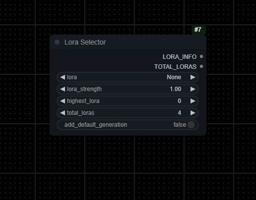
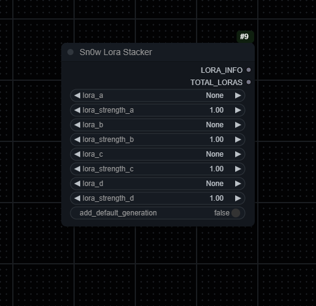

<h1 align="center">
    sn0w-scripts
</h1>

A collection of nodes and improvements created for general ease and testing loras. These are just nodes I made and found useful, they should work with most other nodes. Most nodes that take in a prompt are made with booru tags in mind and might not work as expected with other prompts.

# Get Started

## Install

1. Install [ComfyUi](https://github.com/comfyanonymous/ComfyUI).
2. Clone this repo into `custom_nodes`:
    ```
    git clone https://github.com/sn0w12/ComfyUI-Sn0w-Scripts
    ```
3. Start up ComfyUI.

# Configuration

The `sn0w-scripts` project utilizes a configuration file named `config.json` to manage various settings that influence the behavior of the nodes. This configuration allows for a customizable experience and enables features to be toggled on or off as needed.

## Important Note
Many of the nodes require these paths to be in your extra_model_paths.yaml (with your real directories of course).

- loras_xl: C:/path/XL
- loras_15: C:/path/1.5


## Creating the Configuration File

To get started, create a `config.json` file in the root directory of the `sn0w-scripts` project, or simply change the name of `config.json.example`. Here's a basic example of what this file might look like:

```json
{
    "logging_level": "GENERAL",
    "animagine_formatting": "TRUE",
    "excluded_lora_folders": "character, concept",
    "custom_lora_loaders": {
        "name": "concept"
    },
    "custom_lora_loaders_xl": {
        "name": "style",
        "name": "pony/style"
      },
    "sort_characters_by_series": false
}
```

## Configuration Options

Below is a table detailing the configuration options available in `config.json`, their possible values, and their default settings.

| Option               | Description                                                                                               | Possible Values     | Default   |
|----------------------|-----------------------------------------------------------------------------------------------------------|---------------------|-----------|
| `logging_level`      | Determines the verbosity of logs generated by the scripts.                                                | `NONE`, `GENERAL`, `ALL` | `GENERAL` |
| `animagine_formatting` | Enables or disables specific formatting rules for prompts, such as prioritizing certain tags. | `TRUE`, `FALSE`      | `FALSE`    |
| `excluded_lora_folders` | Removes folders from custom lora loaders. Folders are seperated by comma. | `any string`      |   `None`    |
| `custom_lora_loaders(_xl)` | Creates custom lora loaders, filtering out all folders except ones in the config. | `any string`      |    `None`   |

# Nodes

## Find Resolution
> An easy way to select a width and height.
> <details>
>    <summary>ℹ️ <i>See More Information</i></summary>
>
>    - Enable flip if you want to swap the resolutions
>
>    
>    </details>

## Lora Selector
> Automatically selects X amount of loras between two numbers.
> <details>
>    <summary>ℹ️ <i>See More Information</i></summary>
>
>    - Loras have to be formatted like the default kohya_ss outputs. (lora_name-000001)
>    - Select the first lora.
>    - Select the number of the highest lora you want to test.
>    - Select the amount of loras you want to test.
>    - Outputs list of loras like this: \<lora:name:strength>
>    - Add default generation adds an extra "nothing" at the end of the list, used in Lora Tester to generate an image without the lora.
> 
>    
>    </details>

## Lora Tester (XL)
> Automatically generates X amount of images with provided loras.
> <details>
>    <summary>ℹ️ <i>See More Information</i></summary>
>
>    - I recommend making lora_info and add_default_generation inputs and using the outputs from the Lora Selector.
>    - Takes normal KSampler input but takes positive and negative inputs as text.
>    - Outputs a batch of images.
> 
>    
>    </details>

## Character Selector
> Outputs a character name and prompt.
> <details>
>    <summary>ℹ️ <i>See More Information</i></summary>
>
>    - Loads `characters.json` and outputs prompt based on it.
>    - You can create a file named `custom_characters.json` and add characters there if you want, they will be loaded with all the other characters if you format it like the `characters.json` file.
> 
>    
>    </details>

## Prompt Combine
> Combines multiple strings with a specified separator and optionally simplifies the result by removing redundant or incompatible tags.
> <details>
>    <summary>ℹ️ <i>See More Information</i></summary>
>
>    - If simplify is enabled, the simplification process identifies and removes redundant tags (e.g., when a tag is fully encompassed by another, more descriptive tag) and tags incompatible with factors such as facing away, covered eyes, etc. Any tags that are in parentheses will not be removed.
>    - Simplify will also move 1girl/ 1boy to the front of the prompt to be in line with animagine 3's tagging.
> 
>    
>    </details>

## Lora Stacker
> Outputs a list of loras for Lora Tester. Does not load any loras by itself.
> <details>
>    <summary>ℹ️ <i>See More Information</i></summary>
>
>    - Basically Lora Selector but manual.
>    - Specifically for the lora testers.
> 
>    
>    </details>

## Load Lora XL/1.5
> Normal load lora but from another folder.
> <details>
>    <summary>ℹ️ <i>See More Information</i></summary>
>
>    - Add these to your extra_model_paths.yaml (for example):
>    - loras_xl: C:/path/XL
>    - loras_15: C:/path/1.5
>
>    
>    
>    </details>

## Load Lora Folder
> Dynamically applies Lora models based on similarity to a provided prompt.
> <details>
>    <summary>ℹ️ <i>See More Information</i></summary>
>
>    - This node processes a given prompt to identify and apply the most similar Lora models of the tags found in the prompt.
>    - For each part of the prompt, the node calculates a distance between tags and available Lora model filenames. Models with a difference of under 5 are applied to the input `model` and `clip`.
>    - **Example folder input:** `*master_folder, subfolder1:3, -excludefolder, subfolder2`
>        - `*master_folder` specifies all paths must include `master_folder`.
>        - `subfolder1:3` indicates up to 3 models from `subfolder1` can be loaded.
>        - `-excludefolder` ensures any path containing `excludefolder` is ignored.
>        - `subfolder2` loads models from this subfolder without a numeric limit.
>    - Note: You need the loras separated into XL and 1.5 as stated in the `Important Note`.
>    - Note: Loras need to be named very similarly to the tag, with at most 5 characters different. Words in the lora filename can be separated by spaces or underscores.
>
>    
>    </details>


## Get Font Size Node
> Estimates the optimal font size for text to fit within an image based on Lora information.
> <details>
>    <summary>ℹ️ <i>See More Information</i></summary>
>
>    - This node takes an image and a string, estimating the best font size to ensure that the longest piece of the string fits within the image. The approach considers the image's width and the length of the text to find a size that balances visibility and fit.
>
>    
>    </details>


# Example Workflows
## Lora Tester
Note: Uses [ImagesGrid](https://github.com/LEv145/images-grid-comfy-plugin) for making the actual grid from the image output.

